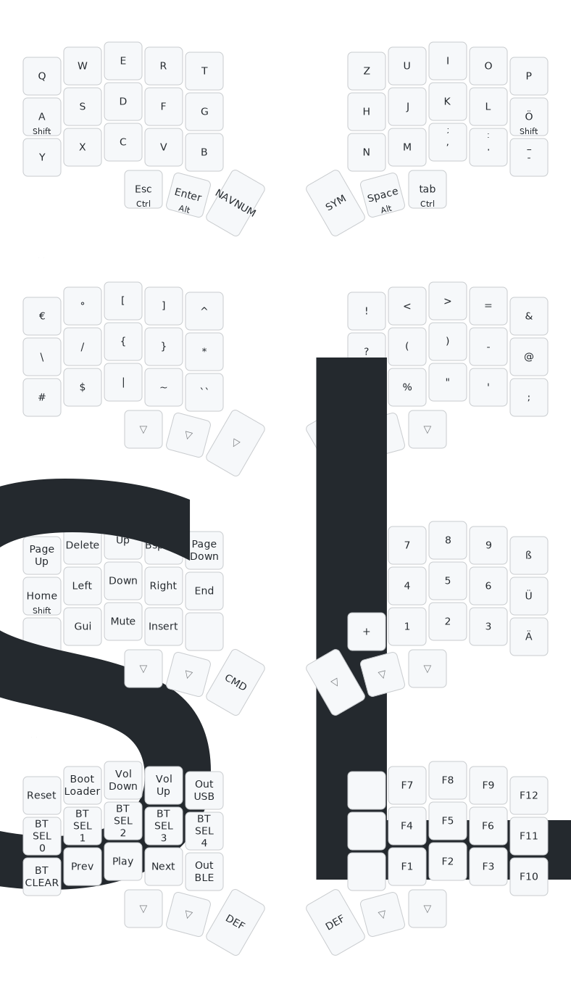

# Split Keyboard with "Qwertz" layout

- Based on ZMK firmware
- Layout: 15 finger keys; 3 thumb keys per side
  [temper](https://github.com/raeedcho/temper) based


**Here is the layout map:**




## How to build locally


In the project root directory

```bash
# remove any existing initialization
rm -rf .west

west init -l ./config  # directory where west.yml is located
```
 creates and populates `.west` directory


```bash
west update
```

creates directories and checks out:

- `zephyr` - zephyr sources
- `zmk` - zmk sources
- `modules` - various modules

```bash
west zephyr-export
```

And now the build

```bash
# left side with nice!view display
rm -rf build-left
mkdir build-left
west build -s zmk/app -b nice_nano_v2 -d build-left --  \
   -DZMK_CONFIG="$(pwd)/config" \
   -DZMK_EXTRA_MODULES="$(pwd)/temper" \
   -DSHIELD="temper_left nice_view_adapter nice_view"

# right side without display
rm -rf build-right
mkdir build-right
west build -s zmk/app -b nice_nano_v2 -d build-right --  \
   -DZMK_CONFIG="$(pwd)/config" \
   -DZMK_EXTRA_MODULES="$(pwd)/temper" \
   -DSHIELD="temper_right"
```
